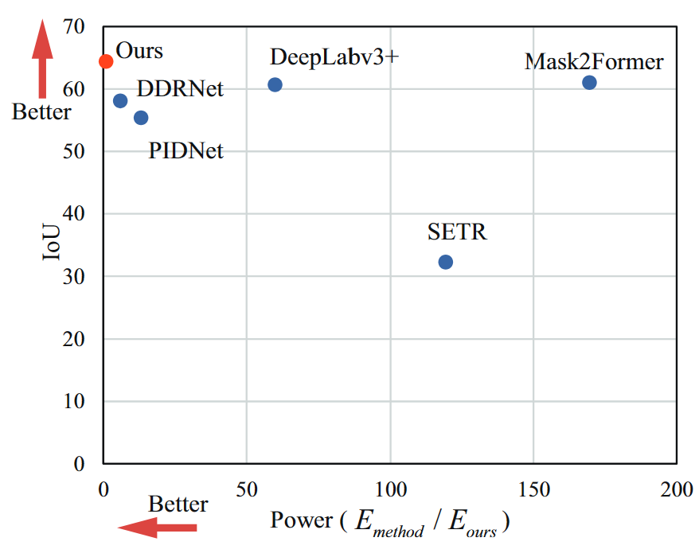

About me
========

I am a Ph.D. student in Computer Science Technology at [Southwest Jiaotong University](https://www.swjtu.edu.cn/), and a joint Ph.D. student at the Southwest Jiaotong University, the University of Birmingham, and the Nanyang Technological University, with a research focus on Computer Vision. I earned my Master's Degree in Software Engineering from the [School of Computing and Artificial Intelligence](https://scai.swjtu.edu.cn/index.html) at the same university. Prior to this, I completed my Bachelor's Degree in Engineering at [Jiangsu University of Science and Technology](https://www.just.edu.cn/), China.

<!-- I obtained my Bachelor's degree in Internet of Things from [Jiangsu University of Science and Technology](https://www.just.edu.cn/) in China, and later received my Master's degree in Software Engineering from [The School Of Computing And Artificial Intelligence](https://scai.swjtu.edu.cn/index.html), [Southwest Jiaotong University](https://www.swjtu.edu.cn/) in 2022.06. Currently, I am pursuing my Ph.D. degree in Computer Science Technology from the same university.

My research interests lie in the fields of railway defects inspection and computer vision. -->

<!-- News 
========
- <b> -->

Publications
========

* **M. Li**, B. Peng and D. Zhai, "Latent Space Segmentation Model for Visual Surface Defect Inspection," in *IEEE Transactions on Instrumentation and Measurement*, vol. 73, pp. 1-11, 2024, Art no. 5029111, doi: 10.1109/TIM.2024.3446650.
    [[web]](https://doi.org/10.1109/TIM.2024.3446650)

* **M. Li**, B. Peng, J. Liu and D. Zhai, "RBNet: An Ultrafast Rendering-Based Architecture for Railway Defect Segmentation," in *IEEE Transactions on Instrumentation and Measurement*, vol. 72, pp. 1-8, 2023, Art no. 2512808, doi: 10.1109/TIM.2023.3269107.
    [[web]](https://doi.org/10.1109/TIM.2023.3269107)

* **M. Li**, D. Zhai, D. Yang and L. Xu, "BVTracker: Multivehicle Tracking Based on Behavioral-Visual Features," in *IEEE Sensors Journal*, vol. 23, no. 11, pp. 11815-11824, 1 June1, 2023, doi: 10.1109/JSEN.2023.3265659.
    [[web]](https://doi.org/10.1109/JSEN.2023.3265659)

* **M. Li**, "Research on precise restoration of thangka and Tibetan murals integrating contour drawing techniques," *Digital Heritage 2025 - 4th International Congress & Expo*. (Accepted)

* **李明旭**, 翟东海. "不规则像素簇显著性检测算法," *中国图象图形学报*, vol. 25, no. 9, pp. 1837-1847, 2020.
    [[web]](https://dx.doi.org/10.11834/jig.190587)

* Ayvaz, D. S., Belenguer, L., He, H., Kanubala, D. D., **Li, M.**, Low, S., Mougan, C., Onwuegbuche, F. C., Pi, Y., Sikora, N., Tran, D., Verma, S., Wang, H., Xie, S., & Pelletier, A. "Measuring Fairness in Financial Transaction Machine Learning Models," *arXiv preprint arXiv:2501.10784*, 2025.
    [[web]](https://arxiv.org/abs/2501.10784)
  
* Guo, Q., Pu, K., Qi, H., **Li, M.**, and Yang, D., "Study on the Behavior Ability Testing of Automated Vehicles," *Transportation Research Board 100th Annual Meeting*, 2021.
    [[web]](https://trid.trb.org/view/1759600)

Recent Work 
========

-  <b>Our New Model</b> 

-  <b>Our Dataset</b> 

  
    

