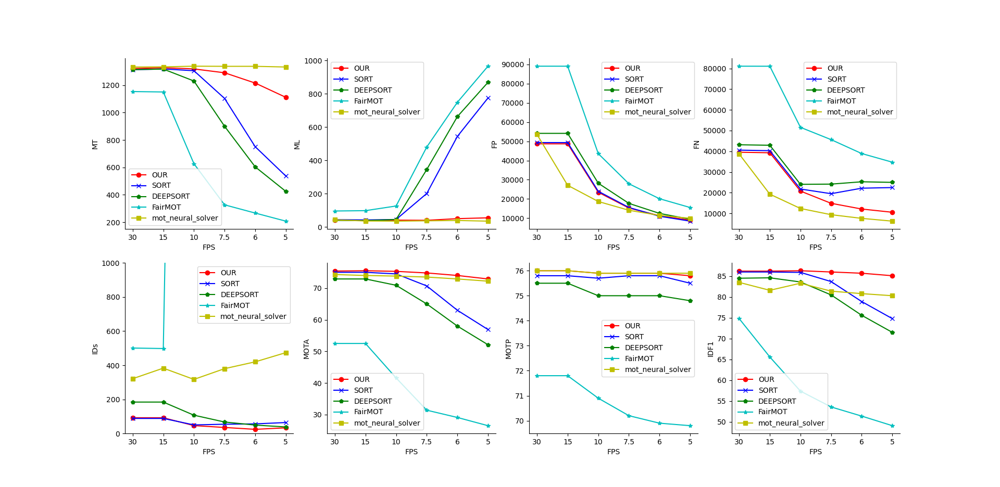
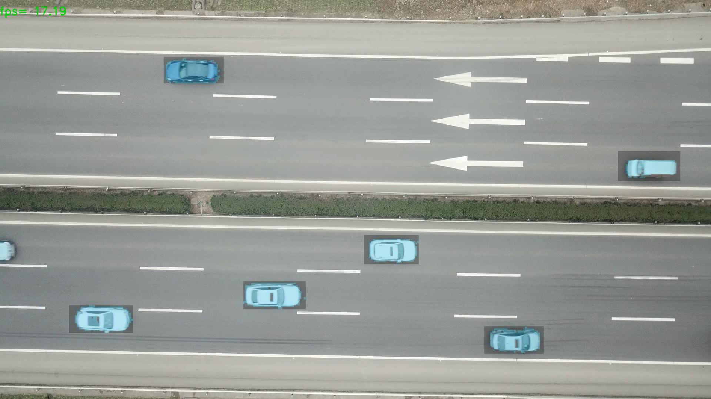
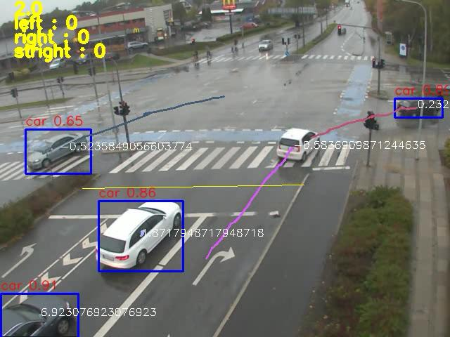
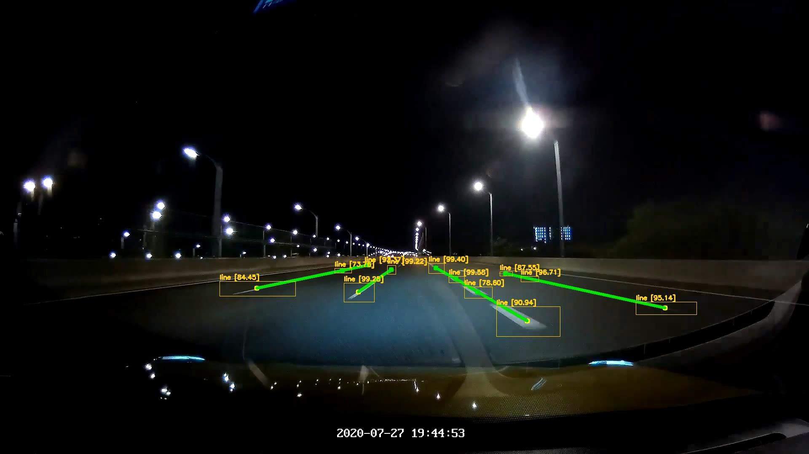

About me
========
I am a graduate student at the [The School Of Information Science And Technology](http://sist.swjtu.edu.cn/index.do?action=index), [Southwest Jiaotong University](https://www.swjtu.edu.cn/). Previously I obtained my  Bachelor's degree of Engineering  from [Jiangsu University of Science and Technology](https://www.just.edu.cn/), China.

News 
========
- <b>Improving Multi-Object Tracking via trajectory prediction from the angle of UAV </b> 

- <b>RBNet: An Ultra Fast Rendering-based Architecture for Railway Defects Segmentation</b> 

Publication  
========

-  <b>Significance detection method with irregular pixel clusters</b> 
   <b>Li Mingxu</b>,Zhai Donghai  
	  [[web]](http://www.cjig.cn/jig/ch/reader/view_abstract.aspx?file_no=20200909&flag=1)  &nbsp;  [[pdf]](/files/paper.pdf)

Project Result 
========

-  <b>Object Segmentation</b> 

-  <b>Vehicle Count</b> 
 
 
-  <b>Multi-lane Lines Detection</b> 
 

  
    

