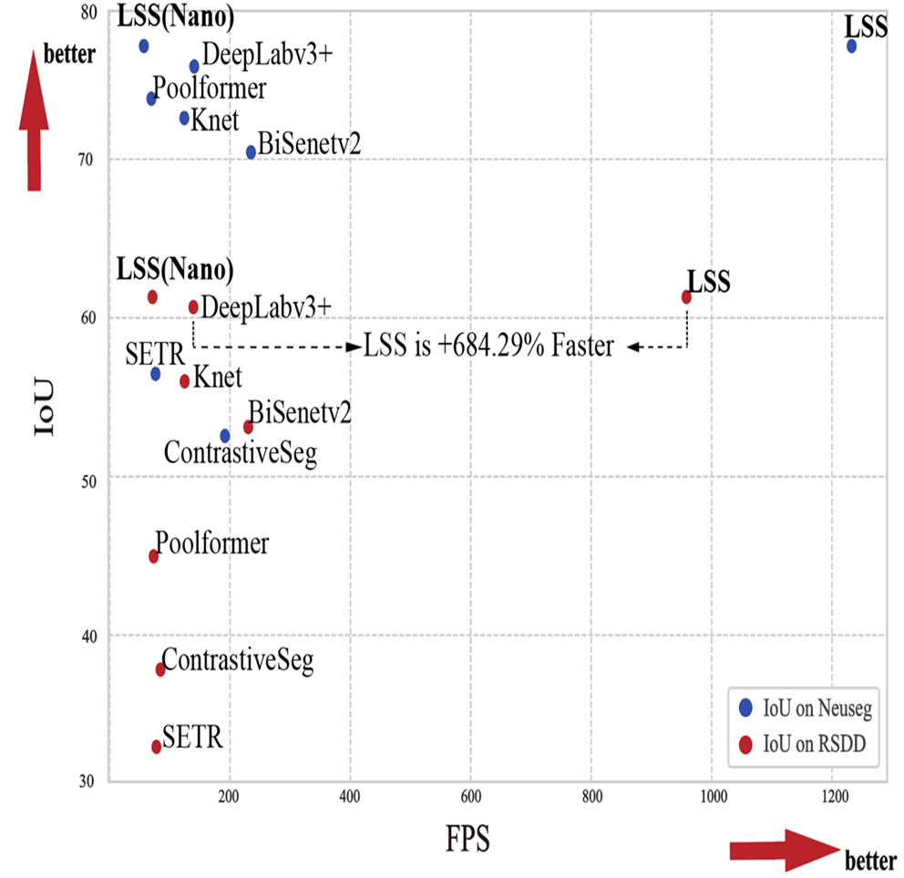

About me
========

I am a Ph.D. student in Computer Science Technology at [Southwest Jiaotong University](https://www.swjtu.edu.cn/), and a joint Ph.D. student at Southwest Jiaotong University, the University of Birmingham, and Nanyang Technological University (NTU), with a research focus on Computer Vision. I earned my Master's Degree in Software Engineering from the [School of Computing and Artificial Intelligence](https://scai.swjtu.edu.cn/index.html) at the same university. Prior to this, I completed my Bachelor's Degree in Engineering at [Jiangsu University of Science and Technology](https://www.just.edu.cn/), China.

<!-- I obtained my Bachelor's degree in Internet of Things from [Jiangsu University of Science and Technology](https://www.just.edu.cn/) in China, and later received my Master's degree in Software Engineering from [The School Of Computing And Artificial Intelligence](https://scai.swjtu.edu.cn/index.html), [Southwest Jiaotong University](https://www.swjtu.edu.cn/) in 2022.06. Currently, I am pursuing my Ph.D. degree in Computer Science Technology from the same university.

My research interests lie in the fields of railway defects inspection and computer vision. -->

<!-- News 
========
- <b> -->

Publication  
========
-  <b>RBNet: An Ultra Fast Rendering-based Architecture for Railway Defects Segmentation (IEEE Transactions on Instrumentation and Measurement)</b> 
   <b>Li Mingxu</b>,Bo Peng ,Jian Liu ,Donghai Zhai*  
	  [[web]](https://ieeexplore.ieee.org/document/10106288)  &nbsp;  [[pdf]](/files/RBNet.pdf)

-  <b>BVTracker: Multi-Vehicle Tracking based on Behavioural-Visual Features (IEEE Sensors Journal)</b> 
   <b>Li Mingxu</b>, Zhai Donghai*, Da Yang ,Lihua Xu  
	  [[web]](https://ieeexplore.ieee.org/document/10102430)  &nbsp;  [[pdf]](/files/BVTracker.pdf)

-  <b>Significance detection method with irregular pixel clusters (Journal of Image and Graphics)</b> 
   <b>Li Mingxu</b>,Zhai Donghai*  
	  [[web]](http://www.cjig.cn/jig/ch/reader/view_abstract.aspx?file_no=20200909&flag=1)  &nbsp;  [[pdf]](/files/paper.pdf)

-  <b>Study on the Behavior Ability Testing of Automated vehicles</b> 
   Qian Guo, Kechen Pu, Huanwei Qi, <b>Mingxu Li</b>, Da Yang*  
	  [[web]](https://trid.trb.org/view/1759600)

Current Works 
========

-  <b>The LiteDepNet</b> 

-  <b>Our Dataset</b> 

<!-- -  <b>Vehicle Count</b> 
 
 
-  <b>Multi-lane Lines Detection</b> 
  -->

  
    

